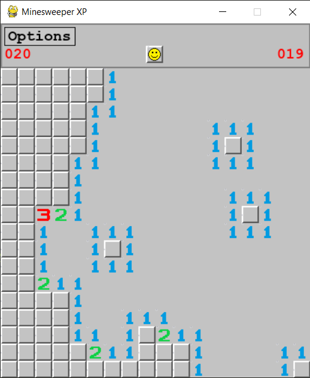

# 🟦 Windows XP-Style Minesweeper

A fully working, retro-style Minesweeper clone with pixel art and UI modeled after the original Windows XP version — built using Python with Pygame and Tkinter.

[](https://creativecommons.org/licenses/by-nc/4.0/)



## 🎯 Features

- Beginner / Intermediate / Expert difficulties
- Classic smiley face reset button 😃😵😎
- Custom-made XP-style pixel art (Paint 3D)
- Timer and mine counter
- Clean retro UI with pixel-perfect visuals

---

## 🛠️ Requirements

- Python 3.10 or higher
- Pygame  
- Tkinter (usually bundled with Python)

pip install -r requirements.txt

## 📜 License

This project is licensed under the [**Creative Commons Attribution-NonCommercial 4.0 International License**](https://creativecommons.org/licenses/by-nc/4.0/).

You are free to:
- Use, share, and modify the code for personal and educational purposes.

**However, commercial use is not allowed.**

Install dependencies:

```bash
